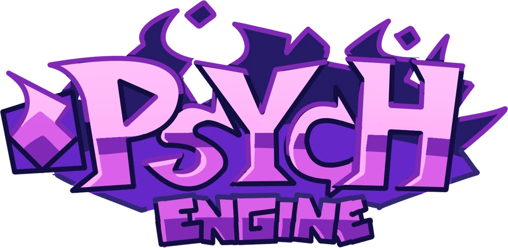
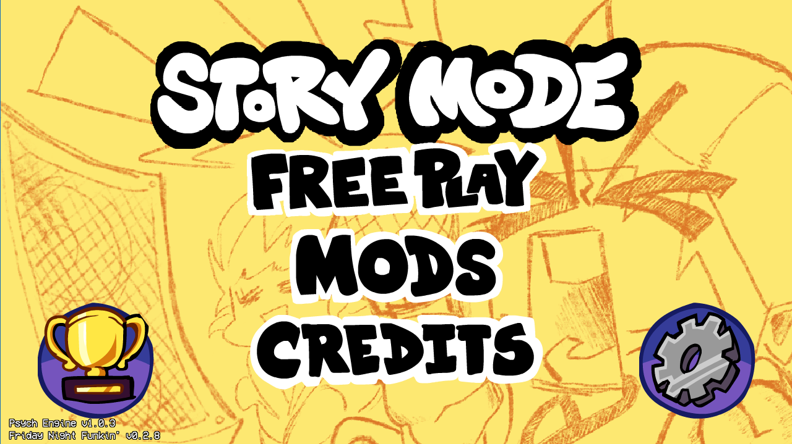
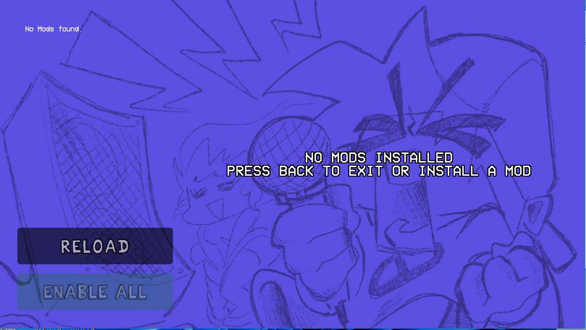
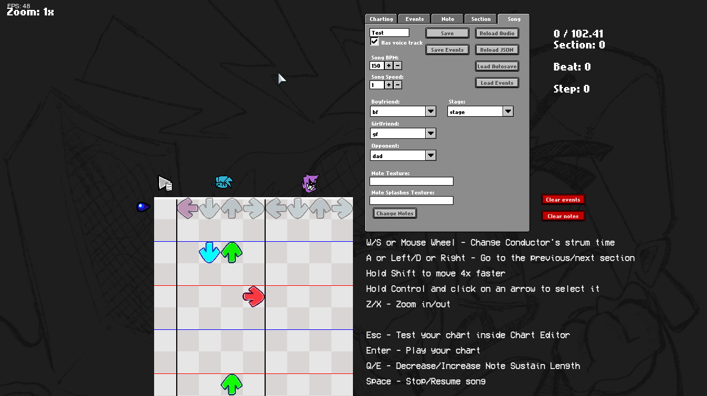
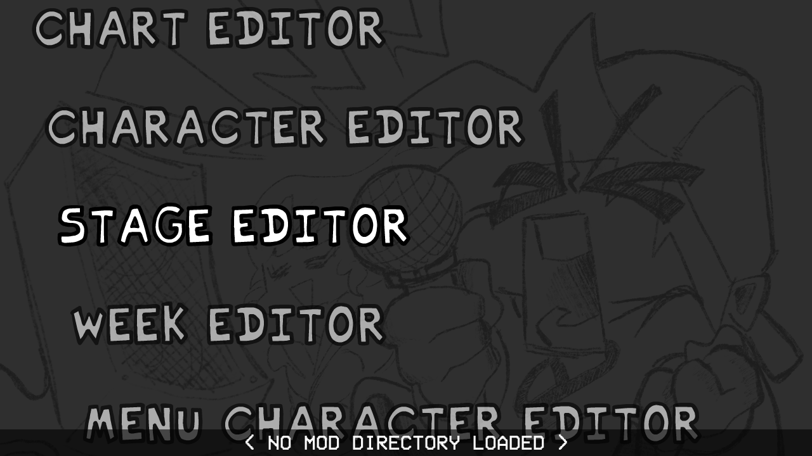
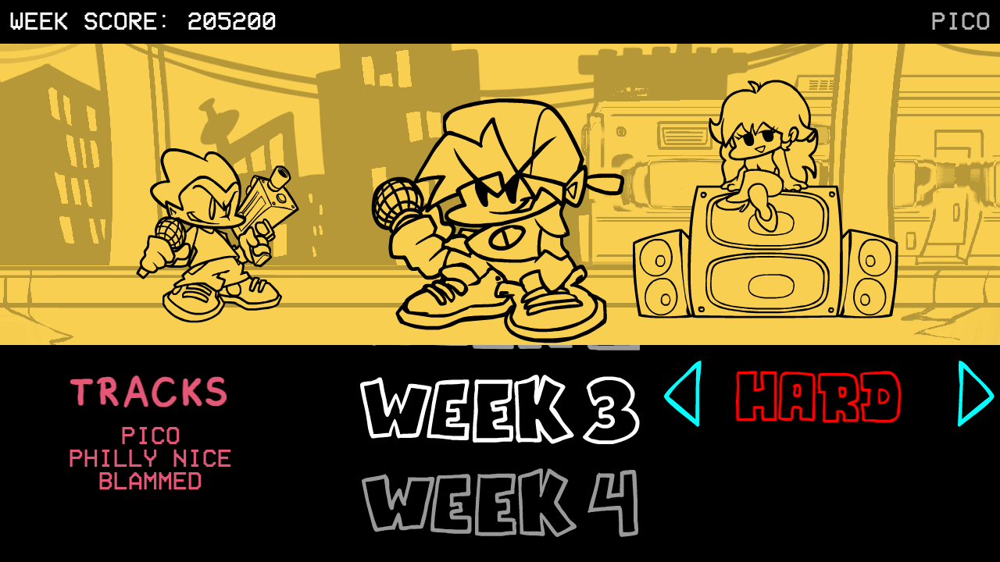
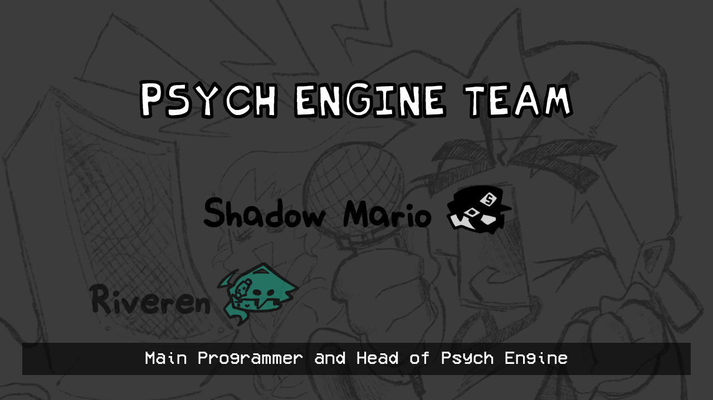
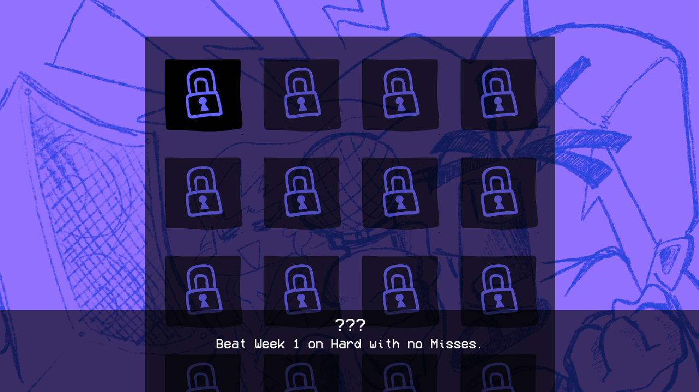
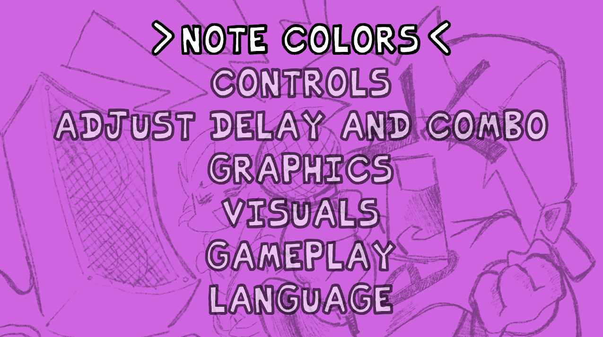

Engine originally used on [Mind Games Mod](https://gamebanana.com/mods/301107), intended to be a fix for the vanilla version's many issues while keeping the casual play aspect of it. Also aiming to be an easier alternative to newbie coders.

## Installation:

Refer to [the Build Instructions](/docs/BUILDING.md)

## Customization:

If you wish to disable things like *Lua Scripts* or *Video Cutscenes*, you can refer to the `Project.xml` file.

Inside `Project.xml`, you will find several variables to customize Psych Engine to your liking.

To start you off, disabling *Video Cutscenes* should be simple, simply delete the line `"VIDEOS_ALLOWED"` or comment it out by wrapping the line in XML-like comments, like this: `<!-- YOUR_LINE_HERE -->`

Same goes for *Lua Scripts*, comment out or delete the line with `LUA_ALLOWED`, this and other customization options are all available within the `Project.xml` file.

## Softcoding (.lua/.hx)
For this you can head over to [the wiki](https://shadowmario.github.io/psychengine.lua)

There you can learn how to use the 212 PlayState funcions in your mod!

## Credits:
* Shadow Mario - Main Programmer and Head of Psych Engine.
* Riveren - Main Artist/Animator of Psych Engine.

### Special Thanks
* bbpanzu - Ex-Team Member (Programmer).
* crowplexus - HScript Iris, Input System v3, and Other PRs.
* Kamizeta - Creator of Pessy, Psych Engine's mascot.
* MaxNeton - Loading Screen Easter Egg Artist/Animator.
* Keoiki - Note Splash Animations and Latin Alphabet.
* SqirraRNG - Crash Handler and Base code for Chart Editor's Waveform.
* EliteMasterEric - Runtime Shaders support and Other PRs.
* MAJigsaw77 - .MP4 Video Loader Library (hxvlc).
* Tahir Toprak Karabekiroglu - Note Splash Editor and Other PRs.
* iFlicky - Composer of Psync, Tea Time and some sound effects.
* KadeDev - Fixed some issues on Chart Editor and Other PRs.
* superpowers04 - LUA JIT Fork.
* CheemsAndFriends - Creator of FlxAnimate.
* Ezhalt - Pessy's Easter Egg Jingle.
* MaliciousBunny - Video for the Final Update.

***

# Features

## Attractive animated dialogue boxes:

## New Main Menu
* A brand new menu that makes your experience even better!

## Mod Support
* Probably one of the main points of this engine, you can code in .lua files outside of the source code, making your own weeks without even messing with the source!
* Comes with a Mod Organizing/Disabling Menu.

## Atleast one change to every week:
### Week 1:
  * New Dad Left sing sprite
  * Unused stage lights are now used
  * Dad Battle has a spotlight effect for the breakdown
### Week 2:
  * Both BF and Skid & Pump does "Hey!" animations
  * Thunders does a quick light flash and zooms the camera in slightly
  * Added a quick transition/cutscene to Monster
### Week 3:
  * BF does "Hey!" during Philly Nice
  * Blammed has a cool new colors flash during that sick part of the song
### Week 4:
  * Better hair physics for Mom/Boyfriend (Maybe even slightly better than Week 7's :eyes:)
  * Henchmen die during all songs. Yeah :(
### Week 5:
  * Bottom Boppers and GF does "Hey!" animations during Cocoa and Eggnog
  * On Winter Horrorland, GF bops her head slower in some parts of the song.
### Week 6:
  * On Thorns, the HUD is hidden during the cutscene
  * Also there's the Background girls being spooky during the "Hey!" parts of the Instrumental

## Cool new Chart Editor changes and countless bug fixes

* You can now chart "Event" notes, which are bookmarks that trigger specific actions that usually were hardcoded on the vanilla version of the game.
* Your song's BPM can now have decimal values
* You can manually adjust a Note's strum time if you're really going for milisecond precision
* You can change a note's type on the Editor, it comes with five example types:
  * Alt Animation: Forces an alt animation to play, useful for songs like Ugh/Stress
  * Hey: Forces a "Hey" animation instead of the base Sing animation, if Boyfriend hits this note, Girlfriend will do a "Hey!" too.
  * Hurt Notes: If Boyfriend hits this note, he plays a miss animation and loses some health.
  * GF Sing: Rather than the character hitting the note and singing, Girlfriend sings instead.
  * No Animation: Character just hits the note, no animation plays.

## Multiple editors to assist you in making your own Mod

* Working both for Source code modding and Downloaded builds!

## Story mode menu rework:

* Added a different BG to every song (less Tutorial)
* All menu characters are now in individual spritesheets, makes modding it easier.

## Credits menu

* You can add a head icon, name, description and a Redirect link for when the player presses Enter while the item is currently selected.

## Awards/Achievements
* The engine comes with 16 example achievements that you can mess with and learn how it works (Check Achievements.hx and search for "checkForAchievement" on PlayState.hx)

## Options menu:
* You can change Note colors, Delay and Combo Offset, Controls and Preferences there.
 * On Preferences you can toggle Downscroll, Middlescroll, Anti-Aliasing, Framerate, Low Quality, Note Splashes, Flashing Lights, etc.

## Other gameplay features:
* When the enemy hits a note, their strum note also glows.
* Lag doesn't impact the camera movement and player icon scaling anymore.
* Some stuff based on Week 7's changes has been put in (Background colors on Freeplay, Note splashes)
* You can reset your Score on Freeplay/Story Mode by pressing Reset button.
* You can listen to a song or adjust Scroll Speed/Damage taken/etc. on Freeplay by pressing Space.
* You can enable "Combo Stacking" in Gameplay Options. This causes the combo sprites to just be one sprite with an animation rather than sprites spawning each note hit.

#### Psych Engine by ShadowMario, Friday Night Funkin' by ninjamuffin99
